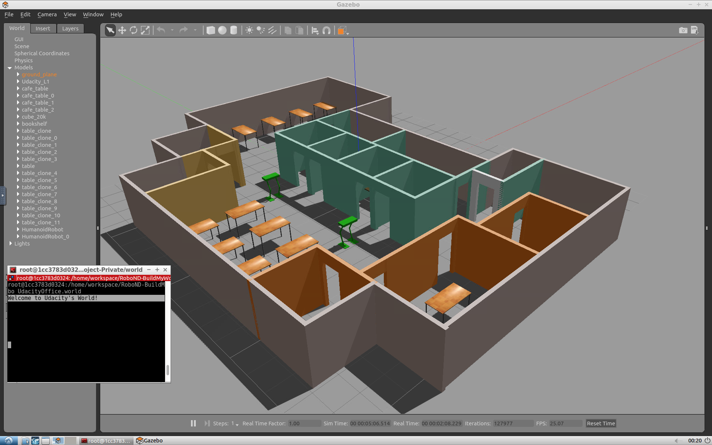

# Build My World

## Introduction
[---](https://youtu.be/UWbLY8LjP-A)

## Sample Simulation World
To help you get started, I’ve included a sample simulation. Reviewing the sample, its aspects, and the directory structure will help you build your own world in Gazebo. Please note that you have only visual access to the sample simulation as it's not provided to you in the Udacity Workspace or anywhere else.

**Output Image**

### Project Aspects
Inside the Gazebo world you can identify:

- Udacity Office: A building model designed on the Building Editor tool of Gazebo. The structure contains features, and colors.
- Green humanoid robot: Two instances of a model designed on the Model Editor tool of Gazebo.
- Tables: A model imported from the Gazebo online library.
- Terminal: A welcome message generated from a world plugin and printed to the terminal.

### Directory Structure
The sample simulation world folder has the following directory structure:

    .Project1                          # Build My World Project 
    ├── model                          # Model files 
    │   ├── Building
    │   │   ├── model.config
    │   │   ├── model.sdf
    │   ├── HumanoidRobot
    │   │   ├── model.config
    │   │   ├── model.sdf
    ├── script                         # Gazebo World plugin C++ script      
    │   ├── welcome_message.cpp
    ├── world                          # Gazebo main World containing models 
    │   ├── UdacityOffice.world
    ├── CMakeLists.txt                 # Link libraries 
    └──             

### Your task
Note that your project should have the same aspects and should follow the same directory structure as the sample project! Pick a place where you want to deploy your robot, for example: your apartment, your office, or your favorite restaurant. In addition, create any model of your choice and import a model from the Gazebo library.

Be advised that occasionally Gazebo gets stuck in a loading loop. If Gazebo does not fully load after about one minute, try closing it by pressing Ctrl+C while the Gazebo terminal is active. Then, try running the command again to restart Gazebo.
